# Exercise 3. Creating an application to monitor room temperature and humidity

#### Estimated time

00:45

## Overview

In this exercise, you create an IoT system by using IBM Watson IoT
Platform. The purpose of the system is to monitor the temperature and
humidity of a facility and optimize the use of air conditioning. You use
the Watson IoT Platform device simulator to simulate the devices that
send temperature and humidity values through the internet to Watson IoT
Platform. Finally, you visualize the data that is sent by the devices in
real time by using the dashboard.

## Objectives

After completing this exercise, you should be able to:

  - Add a device to Watson IoT Platform and retrieve the credentials.

  - Use the Watson IoT Platform simulator to monitor temperature and
    humidity.

  - Chart the data on Watson IoT Platform.

## Introduction

Watson IoT Platform provides the building blocks for any IoT system,
device registry, authentication and authorization for devices and
applications, and data visualization.

You can have an end to end functioning system without writing a single
line of code for the back end. In this solution, you are concerned only
with device connectivity.

## Prerequisites

Complete exercise *Creating your first IoT application*.

## Requirements

You must have an active IBM Cloud account.

## Exercise instructions

In this exercise, you complete the following tasks:

- [X] Configure devices on Watson IoT Platform.

- [X] Connect the device to the simulator.

## _Part 1. Configuring devices on Watson IoT Platform_ 

This part shows how to access Watson IoT Platform over IBM
Cloud, add a device and configure it, and generate an API key and
authentication token that are required to link real devices or external
simulators to IBM Watson IoT Platform.

Complete the following steps:

1. Log in to IBM Cloud . From the Navigation Menu (hamburger button),
    select **Resource List** as shown in the following figure.

   

2. Expand the **Services** section and double-click the **Internet of
    Things Platform** service.

   

3. Click **Launch** to get started with Watson IoT Platform.

   

4. The Browse Devices window opens, as shown in the following
    figure.

   

5. Select the **Device Types** tab and click **Add Device Type** in the
    upper right, as shown in the following figure.

   

6. Specify the device type, name, and description as follows:

   - **Type**: Select **Device**.

   - **Name**: Enter **RoomSensors**

   - **Description**: This device monitors room temperature and humidity
    
   Click **Next.**

   

   >**Note:** In this step, you create the **device type**, which is not the device itself. The device type *name* is used to identify  the device type uniquely. For example, in a home automation system, a building can have multiple air-conditioners that send the same data points, temperature, and humidity. In this case, you define **Device Type** as air-conditioner and have multiple devices of this type, for example, 1st Floor air-conditioner and 2nd Floor air-conditioner. In this exercise, the device type name is *RoomSensors*.

   >**Information:** In certain situations, if the device cannot directly connect to the internet, it is aggregated first through a gateway. A gateway device can be built to retrieve and send data to applications in
>your Watson IoT Platform by using the MQTT or HTTP messaging protocol. In this exercise, you use the default device type (you do not need a gateway).

7. It is optional to add more information about the device type, such as *Serial Number*, *Model,* *Hardware Version,* and more.
    Click **Finish** as shown in the following figure.

   

8. Click **Register Devices** to register a device of type RoomSensors.

   

   >**Note:** The default way to add a device is to click **Devices** from the left navigation bar and then click **Add Device \+** as shown in the following figure.

   

9. Select the device type that you previously created and enter a
    unique device ID as follows:

   - *Device Type*: **RoomSensors**

   - *Device ID*: **TempreatureAndHumidity1**
    
    Click **Next.**

    

10. At the **Device Information** window, use the default values and click **Next**.

    >**Note:** Optionally, you can modify the default device information and enter more information about the device for identification purposes.
    
    

11. At the Security window, use the default option (Auto-generated authentication token) and click **Next**.

    >**Note:** Optionally, you can provide your own authentication token for this device. Do not use this option for this exercise.
    
    

12. At the Summary window, click **Finish**.

    

13. A window with the device credentials opens, as shown in the
    following figure.

    >**IMPORTANT:** You must save the authentication token because after the window that is shown in the following figure closes, you cannot access the authentication token again. 
    >If you lose the authentication token, you must reregister the device to generate a new authentication token.

    

14. Copy the **Authentication Token** that is show in the credentials page, and save it in a safe place for later use.

15. Click the back arrow on the upper left to return to the Watson IoT
    Platform dashboard.
    
    

## _Part 2. Connecting the device to the simulator_ 

To test Watson IoT Platform, you can use a simulated device that acts
like a real device. This simulator generates programmed and customized
values for temperature and humidity, then it sends them through the
internet to Watson IoT Platform. However, the device must be configured
to authenticate itself to Watson IoT Platform.

Complete the following steps:

1. Get the **Organization ID** of your **IBM Watson IoT Platform**
    instance from the upper right of the window, as shown in the
    following figure.

    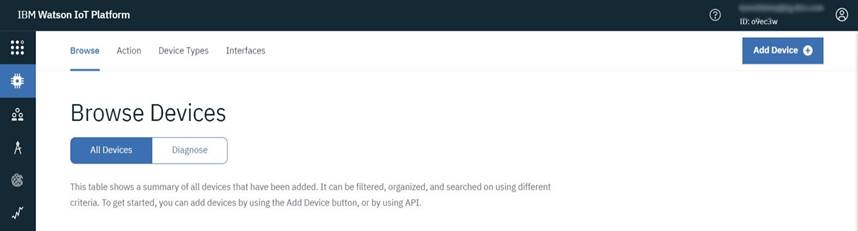

1.  Access Watson IoT Sensor Simulator by opening a new tab in the
    browser and entering the URL
    <http://watson-iot-sensor-simulator.mybluemix.net/>. A dialog box
    opens, as shown in the following figure. Complete it as follows:

    - *Organization ID:* Your organization ID from step 1

    - *Device Type:* RoomSensors

    - *Device ID:* TempreatureAndHumidity1

    - *Device Token:* The **Authentication Token** from Part 1

    Click **Save changes**.

    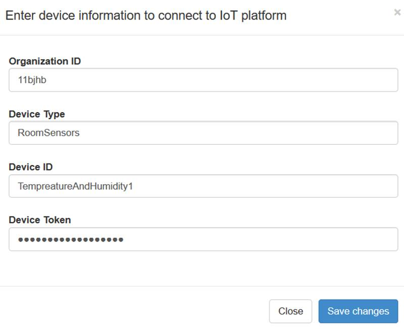

1. The simulator sends its data to the device that was created in Part
    1, as shown in the following figures. To check the temperature, the
    humidity, and the object temperature values, go between the pages by
    swiping left and right.

    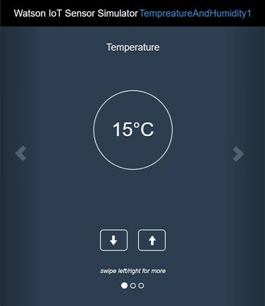

    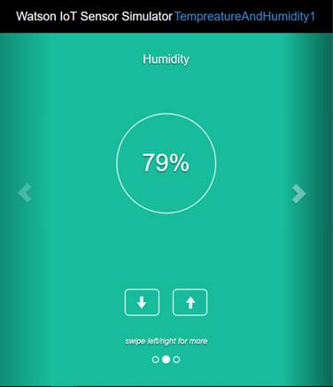

    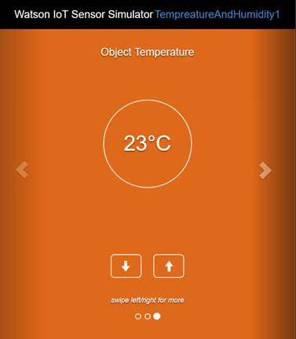

1. To view the status and the data that is collected, go to the **IBM
    Watson IoT Platform** **Boards menu that can be accessed from the
    upper-right icon,** as shown in the following figure.

    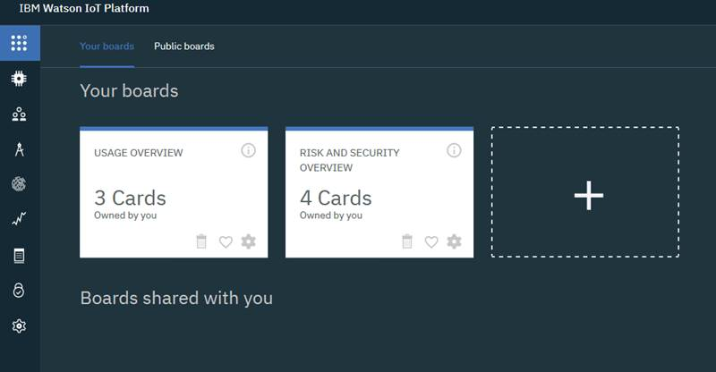

1. Click **Usage Overview**, which includes three cards, to see the
    status and the data of your simulated device.

   >**Note:** There is a board that is called **Risk and Security Overview**,
   >which is provided by default after you create the service from
   >IBM Cloud. **Usage Overview** is created automatically after the
   >device and the device type creation.

1. In the Usage Overview page, click **\+ Add New Card**, as shown in
    the following figure.

   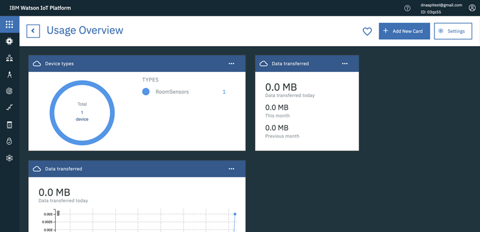

1. There are different types of cards for data visualization, usage,
    risk management, and more as shown in the following figure. Click
    **Line chart.**

   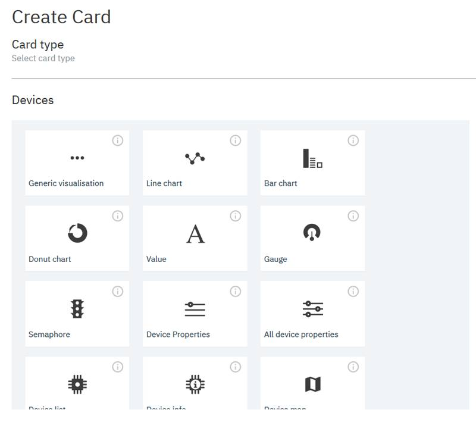

1. Select the device that you want to monitor by clicking the radio
    button to its left. In this case, it is TempreatureAndHumidity1.
    Click **Next,** as shown in the following figure.
    
    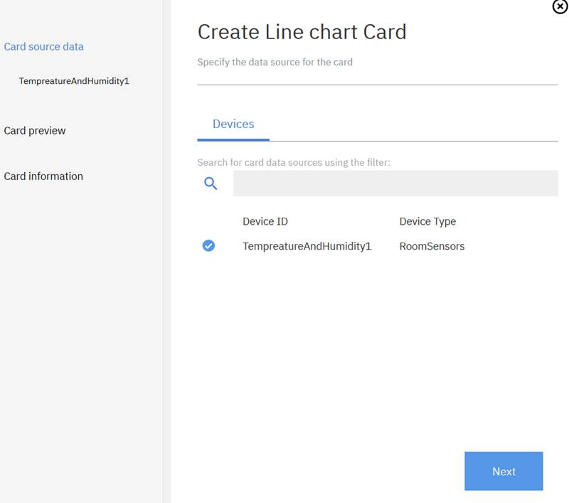

1. Click **\+ Connect new data set**.
    
   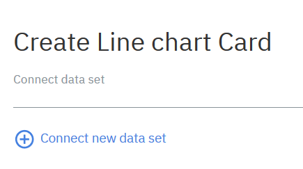

1. Complete the form as follows:

    - Event: **iotsensor**

    - Property: **temperature**

    - Name: **temperature**

    - Type: **Number**

    - Unit: **C**

    - Min: **0**

    - Max: **100**
    
    Click **Next.**

    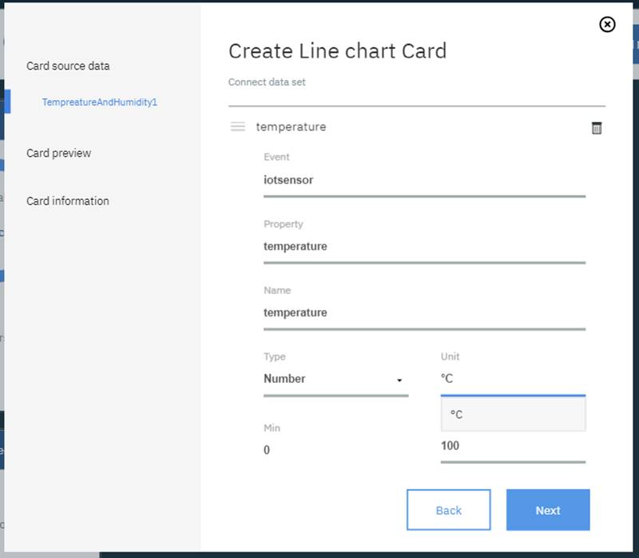

1. In Create Line chart Card, select **XL** for better visualization,
    and click **Next**.
    
    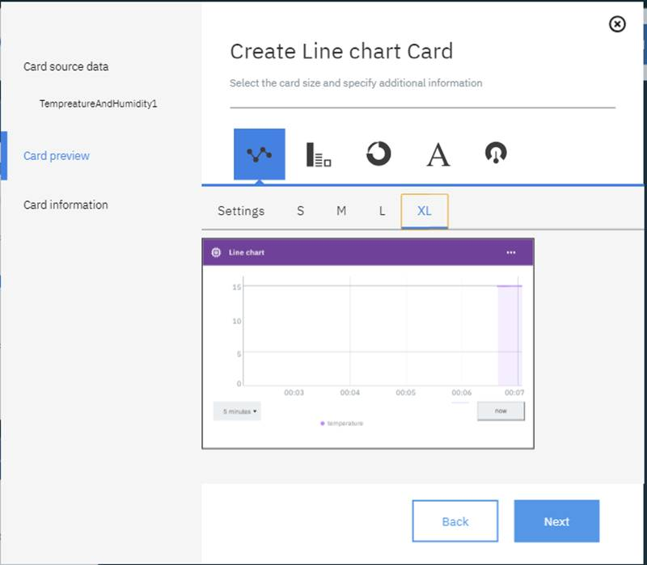

1. In the next window, accept the defaults and click **Submit**.
    
    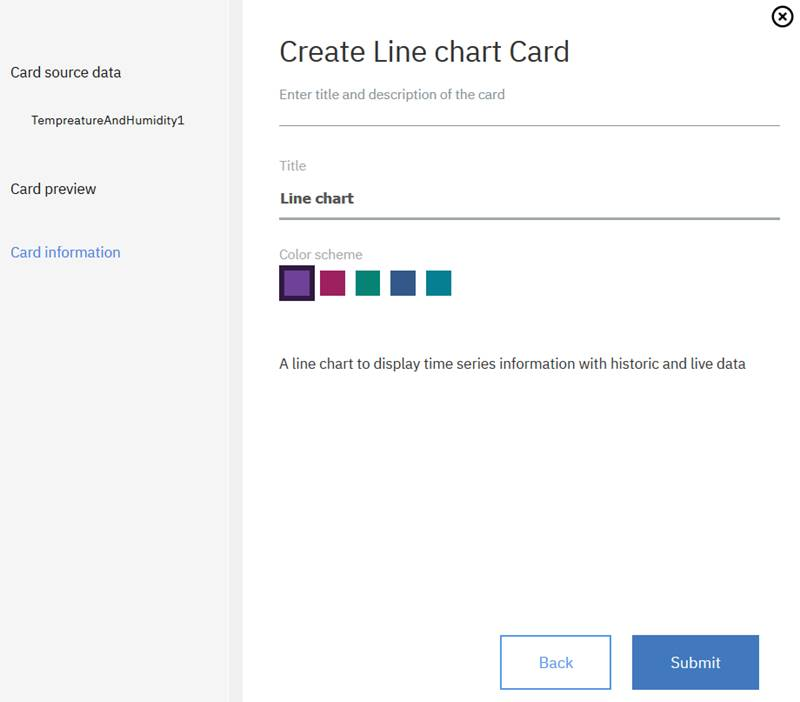

1. Go back to the simulated device (Watson IoT Sensor Simulator) and
    keep changing the temperature values by using the up and down
    arrows, as shown in the following figure.

   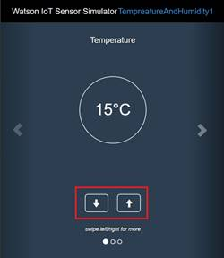

1. Monitor the line chart in IBM Watson IoT Platform under the
    Usage Overview card to validate the changes in the values, as
    shown in the following figure. As shown in the following chart,
    changes in the temperature up and down using the arrows are
    reflected in the chart

   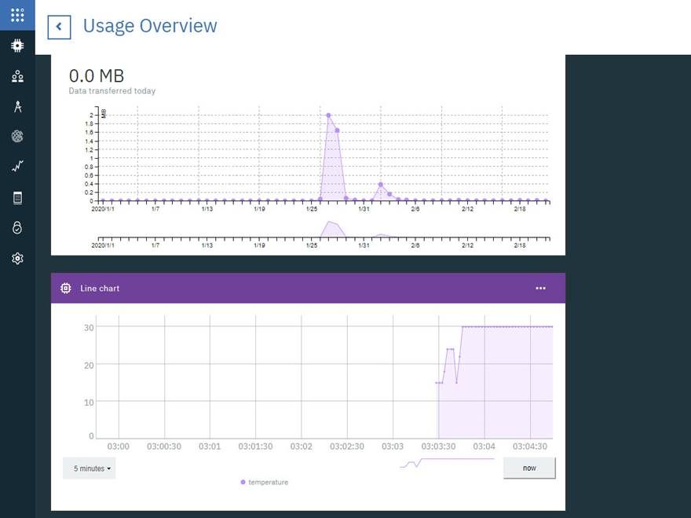

## Exercise review and wrap-up

Now, you can identify the difference between device type and device and
how to configure both. Also, you can connect a device to Watson IoT
Platform and visualize the data in real time with a pre-built UI
dashboard.

[Go back to _Exercises Guide Overview_](index.md)
